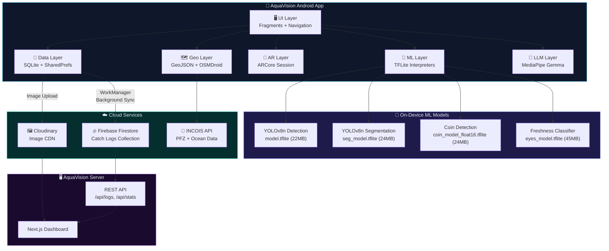
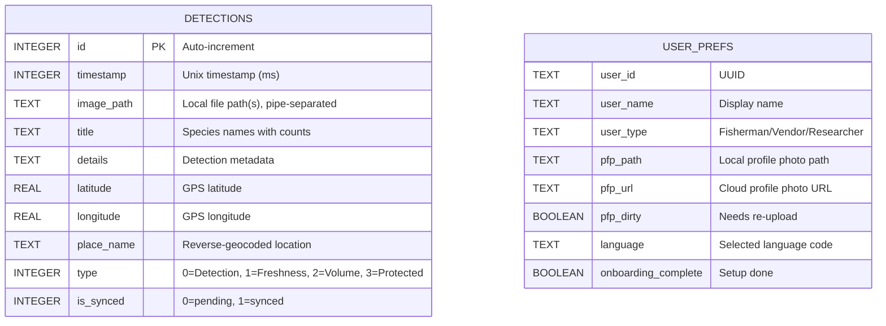
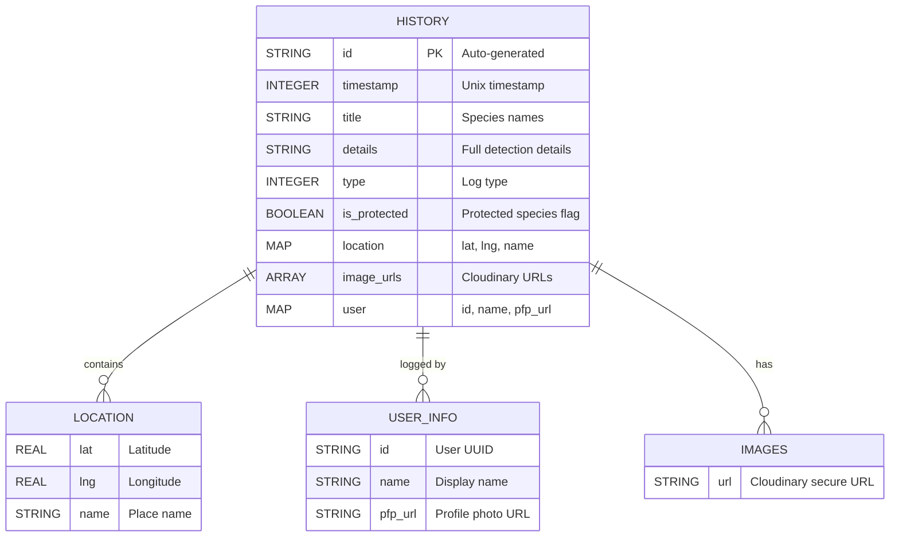
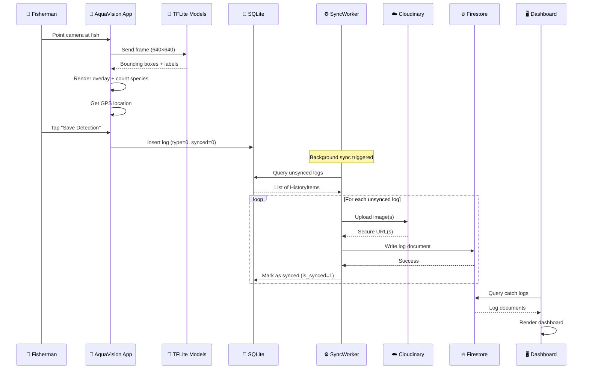

<div align="center">

# 🐟 AquaVision — AI-Powered Fisheries Intelligence

### Real-Time Fish Species Detection, Freshness Analysis & Maritime Monitoring

[](https://developer.android.com)
[](https://kotlinlang.org)
[](https://www.tensorflow.org/lite)
[](https://ultralytics.com)
[](https://firebase.google.com)
[](https://developers.google.com/ar)
[](LICENSE)
[](https://sdgs.un.org/goals/goal14)

*Empowering fishermen with AI-driven species identification, quality assessment, and conservation tools — aligned with **UN SDG 14: Life Below Water**.*

</div>

---

## 📋 Table of Contents

- [Overview](#-overview)
- [Key Features](#-key-features)
- [System Architecture](#-system-architecture)
- [YOLOv8 Model Architecture](#-yolov8-model-architecture)
- [Database Schema (ER Diagram)](#-database-schema-er-diagram)
- [Data Flow & Sync Architecture](#-data-flow--sync-architecture)
- [Tech Stack](#-tech-stack)
- [Supported Species](#-supported-species)
- [Project Structure](#-project-structure)
- [Getting Started](#-getting-started)
- [Configuration](#-configuration)
- [App Screens & Features](#-app-screens--features)
- [ML Models](#-ml-models)
- [Conservation & Protected Species](#-conservation--protected-species)
- [Server Dashboard](#-server-dashboard)
- [API Reference](#-api-reference)
- [Contributing](#-contributing)
- [License](#-license)
- [Acknowledgements](#-acknowledgements)

---

## 🌊 Overview

**AquaVision** is a comprehensive Android application designed for the Indian fisheries sector. It leverages on-device AI to provide:

- **Real-time fish species detection** using YOLOv8 (65 species including crabs & marine life)
- **Freshness quality assessment** via eye analysis using a dedicated TFLite classifier
- **Volume & weight estimation** using instance segmentation + reference coin calibration
- **AR-based fish measurement** using Google ARCore for precise 3D length estimation
- **Protected species alerting** aligned with the Wildlife Protection Act of India
- **Maritime boundary monitoring** with geo-fenced EEZ/territorial water alerts
- **Fishing zone intelligence** with PFZ (Potential Fishing Zone) data from INCOIS
- **Cloud sync** to Firebase Firestore with Cloudinary image hosting
- **On-device AI chat** using MediaPipe's Gemma LLM for offline fisheries guidance
- **Multi-language support** for regional accessibility

---

## ✨ Key Features

| Feature | Description | Technology |
|---|---|---|
| 🎯 **Species Detection** | Real-time detection of 65+ fish/marine species with bounding boxes | YOLOv8 + TFLite + GPU Delegate |
| 👁️ **Freshness Analysis** | Eye-region classification to determine fish freshness quality | Custom TFLite Classifier |
| 📐 **Volume & Weight** | Automated weight estimation using coin reference + segmentation | YOLOv8-Seg + OpenCV |
| 📏 **AR Measurement** | 3D fish length measurement using augmented reality | Google ARCore |
| 🛡️ **Protected Species** | Automatic flagging of Wildlife Protection Act species | Custom Rule Engine |
| 🗺️ **Maritime Boundary** | EEZ, Territorial, and International water zone monitoring | GeoJSON + Point-in-Polygon |
| 🎣 **Fishing Zones** | PFZ advisories, landing centres & sector-wise data | INCOIS API + OSMDroid |
| 🌊 **Ocean Data** | SST, Chlorophyll, Currents, Wind speed map layers | INCOIS Satellite Data |
| 💬 **AI Chat** | On-device LLM for fisheries Q&A (works offline) | MediaPipe Gemma 2B |
| ☁️ **Cloud Sync** | Background sync of catch logs to Firebase | WorkManager + Cloudinary |
| 📊 **Analytics** | Catch statistics, species breakdown, freshness ratios | Local SQLite + Charts |
| 🌐 **Multi-Language** | Hindi, Marathi, Tamil, Telugu, Bengali, Kannada support | Android Localization |

---

## 🏗️ System Architecture



---

## 🧠 YOLOv8 Model Architecture

The detection pipeline uses **YOLOv8n (Nano)** exported to TensorFlow Lite for on-device inference with GPU acceleration.

```mermaid
graph LR
    subgraph Input["📷 Input"]
        IMG["Camera Frame<br/>640×640×3"]
    end

    subgraph Backbone["🔧 Backbone (Feature Extraction)"]
        C1["Conv 3×3<br/>Stride 2"]
        C2["C2f Block<br/>×2"]
        C3["Conv 3×3<br/>Stride 2"]
        C4["C2f Block<br/>×4"]
        C5["Conv 3×3<br/>Stride 2"]
        C6["C2f Block<br/>×4"]
        C7["Conv 3×3<br/>Stride 2"]
        C8["C2f Block<br/>×2"]
        SPPF["SPPF<br/>5×5 MaxPool"]
    end

    subgraph Neck["🔗 Neck (Feature Fusion - PANet)"]
        UP1["Upsample 2×"]
        CAT1["Concat"]
        C2F_N1["C2f Block"]
        UP2["Upsample 2×"]
        CAT2["Concat"]
        C2F_N2["C2f Block"]
        CONV_D1["Conv 3×3<br/>Stride 2"]
        CAT3["Concat"]
        C2F_N3["C2f Block"]
        CONV_D2["Conv 3×3<br/>Stride 2"]
        CAT4["Concat"]
        C2F_N4["C2f Block"]
    end

    subgraph Head["🎯 Detection Head"]
        D1["Detect P3<br/>80×80<br/>(Small Objects)"]
        D2["Detect P4<br/>40×40<br/>(Medium Objects)"]
        D3["Detect P5<br/>20×20<br/>(Large Objects)"]
    end

    subgraph Post["📊 Post-Processing"]
        NMS["Non-Max Suppression<br/>IoU Threshold: 0.7<br/>Conf Threshold: 0.4"]
        OUT["Bounding Boxes<br/>+ Species Labels<br/>+ Confidence Scores"]
    end

    IMG --> C1 --> C2 --> C3 --> C4 --> C5 --> C6 --> C7 --> C8 --> SPPF

    SPPF --> UP1 --> CAT1 --> C2F_N1 --> UP2 --> CAT2 --> C2F_N2
    C6 -.-> CAT1
    C4 -.-> CAT2

    C2F_N2 --> D1
    C2F_N2 --> CONV_D1 --> CAT3 --> C2F_N3 --> D2
    C2F_N1 -.-> CAT3
    C2F_N3 --> CONV_D2 --> CAT4 --> C2F_N4 --> D3
    SPPF -.-> CAT4

    D1 --> NMS
    D2 --> NMS
    D3 --> NMS
    NMS --> OUT

    style Input fill:#1e3a5f,stroke:#60a5fa,color:#e2e8f0
    style Backbone fill:#1e1b4b,stroke:#818cf8,color:#e2e8f0
    style Neck fill:#1a2e05,stroke:#84cc16,color:#e2e8f0
    style Head fill:#3b0764,stroke:#c084fc,color:#e2e8f0
    style Post fill:#4a1d0a,stroke:#fb923c,color:#e2e8f0
```



### Model Specifications

| Property | Value |
|---|---|
| Architecture | YOLOv8n (Nano) |
| Input Size | 640 × 640 × 3 |
| Parameters | ~3.2M |
| FLOPs | ~8.7G |
| Classes | 65 (Fish + Crabs + Marine Life) |
| Format | TensorFlow Lite (FP32) |
| GPU Acceleration | Yes (via TFLite GPU Delegate) |
| Inference Time | ~30-50ms (on flagship devices) |
| Confidence Threshold | 0.4 |
| IoU NMS Threshold | 0.7 |

---

## 🗄️ Database Schema (ER Diagram)

### Local SQLite Database



### Cloud Firestore Schema



---

## 🔄 Data Flow & Sync Architecture



---

## 🛠️ Tech Stack

### Mobile App
| Category | Technology | Version |
|---|---|---|
| Language | Kotlin | 1.9.x |
| Min SDK | Android 9 (API 28) | - |
| Target SDK | Android 14 (API 34) | - |
| Build System | Gradle (Kotlin DSL) | 8.x |
| UI | View Binding + XML Layouts | - |
| Navigation | Jetpack Navigation Component | 2.7.7 |
| Camera | CameraX | 1.4.0-alpha |
| ML Runtime | TensorFlow Lite | 2.16.1 |
| GPU Acceleration | TFLite GPU Delegate | 2.16.1 |
| Instance Segmentation | TFLite + Custom Pipeline | - |
| Computer Vision | OpenCV | 4.5.3 |
| Augmented Reality | Google ARCore | 1.45.0 |
| On-Device LLM | MediaPipe GenAI (Gemma 2B) | 0.10.24 |
| Image Cropping | uCrop | 2.2.8 |
| Image Loading | Glide | 4.16.0 |
| Maps | OSMDroid (OpenStreetMap) | 6.1.18 |
| Location | Google Play Services Location | 21.0.1 |
| GeoJSON | Google Maps Android Utils | 3.8.2 |

### Cloud & Backend
| Category | Technology |
|---|---|
| Database | Firebase Firestore |
| Image Storage | Cloudinary CDN |
| Background Sync | AndroidX WorkManager |
| Dashboard | Next.js 16 (React) |
| Dashboard Styling | TailwindCSS |
| Dashboard Hosting | Vercel |
| Fishing Zone API | Node.js (Render) |

### Data Sources
| Source | Data |
|---|---|
| INCOIS | Potential Fishing Zones (PFZ), Ocean Advisories |
| INCOIS | Sea Surface Temperature (SST), Chlorophyll |
| India EEZ GeoJSON | Exclusive Economic Zone boundary |
| India Territorial GeoJSON | 12 Nautical Mile limit |
| IUCN Red List | Conservation status of species |
| Wildlife Protection Act | Protected species schedules |

---

## 🐠 Supported Species

### Fish Species (39 Classes)
| # | Species | # | Species |
|---|---|---|---|
| 1 | Aair | 21 | Pangas |
| 2 | Black Pomfret | 22 | Pink Perch |
| 3 | Black Sea Sprat | 23 | Pomfret |
| 4 | Black Snapper | 24 | Puti |
| 5 | Boal | 25 | Red Mullet |
| 6 | Catla | 26 | Red Sea Bream |
| 7 | Chapila | 27 | Rohu |
| 8 | Common Carp | 28 | Sea Bass |
| 9 | Foli | 29 | Shol |
| 10 | Gilt-Head Bream | 30 | Shorputi |
| 11 | Green Chromide | 31 | Shrimp |
| 12 | Horse Mackerel | 32 | Silver Belly |
| 13 | Ilish (Hilsa) | 33 | Silver Carp |
| 14 | Indian Carp | 34 | Striped Red Mullet |
| 15 | KalBaush | 35 | Taki |
| 16 | Magur | 36 | Tarabaim |
| 17 | Mori | 37 | Tengra |
| 18 | Mrigel | 38 | Tilapia |
| 19 | Mullet | 39 | Trout |
| 20 | Pabda | | |

### Crabs & Crustaceans (9 Classes)
| # | Species | Classification |
|---|---|---|
| 1 | Asian Paddle Crab | ✅ Edible |
| 2 | Blue Crab | ✅ Edible |
| 3 | Mud Crab | ✅ Edible |
| 4 | Red Eye Crab | ✅ Edible |
| 5 | Sentinel Crab | ✅ Edible |
| 6 | Curry Puff Crab | ☠️ Poisonous |
| 7 | Devil Crab | ☠️ Poisonous |
| 8 | Floral Egg Crab | ☠️ Poisonous |
| 9 | Purple Shore Crab | ☠️ Poisonous |

### Reef & Marine Life (17 Classes)
Bumphead Parrotfish, Butterflyfish, Napoleon Wrasse, Humpback Grouper, Crown of Thorns, Giant Clam, Sweetlips, Lobster, Moray Eel, Ray, Parrotfish, Sea Cucumber, Grouper, Shark, Turtle, Sea Urchin, Scorpion Fish

---

## 📁 Project Structure

```
AquaVision/
├── app/
│   ├── build.gradle.kts              # Dependencies & build config
│   └── src/main/
│       ├── AndroidManifest.xml        # Permissions & activities
│       ├── assets/                    # ML models & GeoJSON data
│       │   ├── model.tflite           # YOLOv8n detection (22MB)
│       │   ├── model_nano.tflite      # YOLOv8n lite variant (6MB)
│       │   ├── seg_model.tflite       # YOLOv8n segmentation (24MB)
│       │   ├── coin_model_float16.tflite  # Coin detection (24MB)
│       │   ├── eyes_model.tflite      # Freshness classifier (45MB)
│       │   ├── labels.txt             # 65 species labels
│       │   ├── eyes_labels.txt        # Freshness labels [Fresh, Not Fresh]
│       │   ├── india_eez_simplified.geojson
│       │   ├── india_territorial_12nm_simplified.geojson
│       │   ├── india_land_simplified.geojson
│       │   ├── pfz.json              # Potential Fishing Zones
│       │   ├── landing.json          # Fish Landing Centres
│       │   └── sector_new.json       # Fishing sectors
│       ├── java/com/rahul/aquavision/
│       │   ├── MainActivity.kt        # Main entry point
│       │   ├── ar/                    # AR fish measurement
│       │   │   ├── ArFishMeasureActivity.kt
│       │   │   ├── ArBackgroundRenderer.kt
│       │   │   └── ArMeasureOverlay.kt
│       │   ├── data/                  # Data layer
│       │   │   ├── Constants.kt       # App constants
│       │   │   ├── DatabaseHelper.kt  # SQLite helper
│       │   │   ├── ProtectedSpeciesData.kt  # Wildlife Act data
│       │   │   ├── SpeciesData.kt     # Biological constants
│       │   │   └── SyncWorker.kt      # Background Firestore sync
│       │   ├── geofence/              # Maritime boundary monitoring
│       │   │   ├── GeoFenceFragment.kt
│       │   │   ├── MaritimeBoundaryChecker.kt
│       │   │   └── SafeWatersMonitoringService.kt
│       │   ├── ml/                    # Machine learning
│       │   │   ├── BoundingBox.kt     # Detection data class
│       │   │   ├── Detector.kt        # YOLOv8 TFLite inference
│       │   │   ├── FreshnessClassifier.kt  # Freshness model
│       │   │   ├── LlmHelper.kt       # MediaPipe Gemma LLM
│       │   │   ├── ModelManager.kt    # Model loading/management
│       │   │   └── segmentation/      # Instance segmentation
│       │   │       ├── InstanceSegmentation.kt
│       │   │       ├── VolumeCalculator.kt
│       │   │       ├── DrawImages.kt
│       │   │       └── ...
│       │   ├── ui/                    # User interface
│       │   │   ├── camera/            # Live detection camera
│       │   │   │   ├── CameraFragment.kt
│       │   │   │   ├── InAppCameraActivity.kt
│       │   │   │   └── DetectionAdapter.kt
│       │   │   ├── FreshnessFragment.kt    # Freshness check screen
│       │   │   ├── volume/VolumeFragment.kt # Volume estimation
│       │   │   ├── AnalyticsFragment.kt    # Statistics dashboard
│       │   │   ├── history/            # Catch log history
│       │   │   ├── fishing/            # Fishing zone maps
│       │   │   ├── ocean/              # Ocean data layers
│       │   │   ├── chat/               # AI chatbot
│       │   │   ├── profile/            # User profile
│       │   │   ├── onboarding/         # First-run setup
│       │   │   ├── MapFragment.kt      # Location map
│       │   │   ├── MoreFragment.kt     # Tools & features menu
│       │   │   └── customview/OverlayView.kt  # Detection overlay
│       │   └── utils/
│       │       ├── NetworkHelper.kt
│       │       └── UserUtils.kt
│       └── res/                       # Android resources
│           ├── layout/                # 27 XML layouts
│           ├── navigation/nav_graph.xml
│           ├── drawable/              # Icons & backgrounds
│           ├── values/                # Strings, colors, themes
│           └── mipmap/                # App icons
├── gradle/
├── build.gradle.kts                   # Project-level config
├── settings.gradle.kts
└── README.md
```

---

## 🚀 Getting Started

### Prerequisites

- **Android Studio** Hedgehog (2023.1.1) or later
- **JDK 17**
- **Android SDK** API 34
- **Physical Android device** (ARM64, API 28+) — GPU delegate requires real hardware
- **Firebase project** with Firestore enabled
- **Cloudinary account** for image hosting

### Setup Instructions

1. **Clone the repository**
   ```bash
   git clone https://github.com/Rahul9969/AquaVision.git
   cd AquaVision
   ```

2. **Configure Firebase**
   - Create a Firebase project at [console.firebase.google.com](https://console.firebase.google.com)
   - Enable Firestore Database
   - Download `google-services.json` and place it in the `app/` directory

3. **Configure Cloudinary**
   - Create a free account at [cloudinary.com](https://cloudinary.com)
   - Note your Cloud Name, API Key, and API Secret

4. **Create `local.properties`**
   ```properties
   sdk.dir=C\:\\Users\\YOUR_USER\\AppData\\Local\\Android\\Sdk

   CLOUDINARY_CLOUD_NAME=your_cloud_name
   CLOUDINARY_API_KEY=your_api_key
   CLOUDINARY_API_SECRET=your_api_secret
   ```

5. **Build & Run**
   ```bash
   ./gradlew assembleDebug
   ```
   Or open in Android Studio and click **Run** on a connected physical device.

> ⚠️ **Note:** The app requires a physical device with ARM64 architecture. It will not run on x86 emulators due to TFLite GPU delegate and ARCore requirements.

---

## ⚙️ Configuration

### Build Configuration

| Property | Value |
|---|---|
| `applicationId` | `com.rahul.aquavision` |
| `minSdk` | 28 (Android 9) |
| `targetSdk` | 34 (Android 14) |
| `compileSdk` | 34 |
| `jvmTarget` | 17 |
| `ABI Filter` | arm64-v8a only |

### Required Permissions

| Permission | Purpose |
|---|---|
| `CAMERA` | Live fish detection |
| `ACCESS_FINE_LOCATION` | GPS for catch logging |
| `ACCESS_COARSE_LOCATION` | Approximate location |
| `ACCESS_BACKGROUND_LOCATION` | Geo-fence monitoring |
| `INTERNET` | Cloud sync & API calls |
| `FOREGROUND_SERVICE` | Maritime monitoring |
| `POST_NOTIFICATIONS` | Boundary alerts (Android 13+) |
| `READ_MEDIA_IMAGES` | Gallery image access |
| `VIBRATE` | Alert feedback |
| `WAKE_LOCK` | Background processing |

---

## 📱 App Screens & Features

### 1. 📷 Live Detection Camera
- Real-time YOLOv8 inference on camera feed
- Bounding box overlay with species names & confidence
- Multi-fish detection with count aggregation
- GPU-accelerated inference (~30-50ms per frame)
- Tap to capture & save detection log

### 2. 👁️ Freshness Analysis
- Capture/pick fish eye region
- Classify as **Fresh** or **Not Fresh** with confidence score
- Eye-based quality assessment using dedicated TFLite model
- Part-level analysis (Eyes, Gills, Skin)

### 3. 📐 Volume & Weight Estimation
- Place a reference coin (₹10) next to the fish
- Coin detection model calculates real-world scale (px/cm)
- Instance segmentation extracts fish contour
- Volume calculated from segmentation mask
- Weight estimated using species-specific coefficients: `W = a × L^b`

### 4. 📏 AR Fish Measurement
- Uses ARCore depth sensing for 3D measurement
- Place start and end points on the fish
- Real-world distance calculation in centimeters
- Feeds into weight estimation pipeline

### 5. 🗺️ Maritime Boundary Monitor
- Real-time position tracking on maritime map
- **Territorial Waters** (12 NM) boundary checking
- **Exclusive Economic Zone** (200 NM) monitoring
- **International Waters** alert for boundary crossings
- Foreground service for continuous monitoring
- Vibration + notification alerts on zone changes

### 6. 🎣 Fishing Zone Intelligence
- **Potential Fishing Zones (PFZ)** from INCOIS satellite data
- **Fish Landing Centres** across Indian coast
- **Sector-wise** fishing information
- Distance calculation from current location
- Interactive map with zone overlays

### 7. 🌊 Ocean Data Layers
- Sea Surface Temperature (SST) maps
- Chlorophyll concentration visualization
- Ocean currents direction & speed
- Wind speed & direction overlays
- Multi-layer toggle for data exploration

### 8. 💬 AI Chat Assistant
- On-device Gemma 2B LLM via MediaPipe
- Works completely offline
- Fisheries-specific Q&A
- Species information queries
- Regulation guidance

### 9. 📊 Analytics Dashboard
- Total catch count & species breakdown
- Fresh vs. spoiled ratio tracking
- Weekly activity chart
- Top fishing locations
- Eye visibility score tracking
- Size distribution (Small/Medium/Large)
- Hourly activity patterns

### 10. 📜 History & Logs
- Chronological catch log with thumbnails
- Filter by type: Detection, Freshness, Volume, Protected
- Detailed view with GPS coordinates & map
- Cloud sync status indicator

---

## 🧠 ML Models

| Model | Architecture | Purpose | Size | Input | Classes |
|---|---|---|---|---|---|
| `model.tflite` | YOLOv8n | Species detection | 22 MB | 640×640 | 65 |
| `model_nano.tflite` | YOLOv8n (lite) | Lightweight detection | 6 MB | 640×640 | 65 |
| `seg_model.tflite` | YOLOv8n-Seg | Instance segmentation | 24 MB | 640×640 | 65 |
| `coin_model_float16.tflite` | YOLOv8 | Coin reference detection | 24 MB | 640×640 | 1 |
| `eyes_model.tflite` | Custom CNN | Fresh/Not Fresh | 45 MB | 224×224 | 2 |

### Volume Estimation Pipeline

```mermaid
graph LR
    A["📷 Capture Image<br/>with Coin"] --> B["🪙 Coin Detection<br/>coin_model.tflite"]
    B --> C["📏 Calculate Scale<br/>px/cm ratio"]
    C --> D["🐟 Fish Segmentation<br/>seg_model.tflite"]
    D --> E["📐 Contour Analysis<br/>OpenCV"]
    E --> F["🧮 Volume Calc<br/>Disk Integration"]
    F --> G["⚖️ Weight Estimation<br/>W = a × L^b"]

    style A fill:#1e3a5f,stroke:#60a5fa,color:#e2e8f0
    style B fill:#4a1d0a,stroke:#fb923c,color:#e2e8f0
    style C fill:#1a2e05,stroke:#84cc16,color:#e2e8f0
    style D fill:#3b0764,stroke:#c084fc,color:#e2e8f0
    style E fill:#1e1b4b,stroke:#818cf8,color:#e2e8f0
    style F fill:#042f2e,stroke:#2dd4bf,color:#e2e8f0
    style G fill:#4a1d0a,stroke:#fb923c,color:#e2e8f0
```



---

## 🛡️ Conservation & Protected Species

AquaVision automatically flags species protected under the **Wildlife Protection Act of India** and **CITES** appendices.

### Protection Levels

| Schedule | Level | Example Species |
|---|---|---|
| **Schedule I** | Highest Protection | Whale Shark, Manta Ray, Sea Turtles, Sawfish, Seahorse |
| **Schedule II** | Protected | Giant Grouper, Humphead Parrotfish |
| **Schedule IV** | Regulated | Indian Pearl Oyster |
| **CITES II** | Trade Restricted | Napoleon Wrasse, Giant Clam |
| **Regulated** | Seasonal Ban | Hilsa (breeding season), Silver Pomfret (size limit) |

### IUCN Status Tracking

| Code | Status | Color |
|---|---|---|
| CR | Critically Endangered | 🔴 |
| EN | Endangered | 🟠 |
| VU | Vulnerable | 🟡 |
| NT | Near Threatened | 🔵 |
| LC | Least Concern | 🟢 |

When a protected species is detected, the app:
1. 🚨 Displays an immediate alert with conservation details
2. 📝 Logs the encounter as `TYPE_PROTECTED` in the database
3. ☁️ Syncs to Firestore with `is_protected: true` flag
4. 📊 Aggregates on the server dashboard's Conservation tab

---

## 🖥️ Server Dashboard

The companion **Next.js** dashboard ([AquaVision Server](https://github.com/Rahul9969/AquaVision_Server)) provides:

### Dashboard Tabs

| Tab | Features |
|---|---|
| **Overview** | Total catches, unique species, protected alerts, freshness index, top species chart, top locations, 30-day trend |
| **Catch Logs** | Expandable log cards with full details: date/time, GPS coordinates, location name, user info, enlarged images, and separated detail lines |
| **Conservation** | Expandable protected species encounters with detection locations, last-seen timestamps, and conservation alerts |
| **Users** | Active user list with total logs, protected count, and last active date |

---

## 📡 API Reference

### Server Dashboard APIs

| Endpoint | Method | Description |
|---|---|---|
| `/api/stats` | GET | Aggregate statistics (catches, species, locations, trends) |
| `/api/logs?limit=50` | GET | Recent catch logs with user/location data |
| `/api/logs?species=Rohu` | GET | Filter logs by species name |
| `/api/protected-species` | GET | Protected species summary with counts & locations |
| `/api/users` | GET | User list with activity metrics |
| `/api/auth` | POST | Dashboard login authentication |

### Fishing Zone API (External)

| Endpoint | Description |
|---|---|
| `GET /pfz` | Potential Fishing Zone advisories |
| `GET /landing-centers` | Fish landing centre locations |
| `GET /sectors` | Fishing sector boundaries |

---

## 🤝 Contributing

1. **Fork** the repository
2. **Create** a feature branch: `git checkout -b feature/my-feature`
3. **Commit** your changes: `git commit -m "feat: add my feature"`
4. **Push** to your fork: `git push origin feature/my-feature`
5. **Open** a Pull Request

### Code Style
- Kotlin coding conventions
- XML layout naming: `fragment_*.xml`, `item_*.xml`, `activity_*.xml`
- Resource naming: `ic_*` for icons, `bg_*` for backgrounds
- Use ViewBinding (no `findViewById`)

---

## 📄 License

This project is licensed under the MIT License. See [LICENSE](LICENSE) for details.

---

## 🙏 Acknowledgements

| Resource | Purpose |
|---|---|
| [Ultralytics YOLOv8](https://ultralytics.com) | Object detection architecture |
| [TensorFlow Lite](https://www.tensorflow.org/lite) | On-device ML inference |
| [Google ARCore](https://developers.google.com/ar) | Augmented reality measurement |
| [MediaPipe](https://developers.google.com/mediapipe) | On-device LLM (Gemma) |
| [Firebase](https://firebase.google.com) | Cloud database & sync |
| [Cloudinary](https://cloudinary.com) | Image storage & CDN |
| [INCOIS](https://incois.gov.in) | Ocean & fishing zone data |
| [OSMDroid](https://osmdroid.github.io/osmdroid/) | Open-source map tiles |
| [OpenCV](https://opencv.org) | Computer vision processing |
| [Wildlife Protection Act, 1972](https://legislative.gov.in) | Protected species data |
| [IUCN Red List](https://www.iucnredlist.org) | Conservation status |

---

<div align="center">

**Built with ❤️ for Indian Fisheries | Aligned with UN SDG 14: Life Below Water**

🐟 *AquaVision — Seeing the Ocean Through AI* 🌊

</div>
