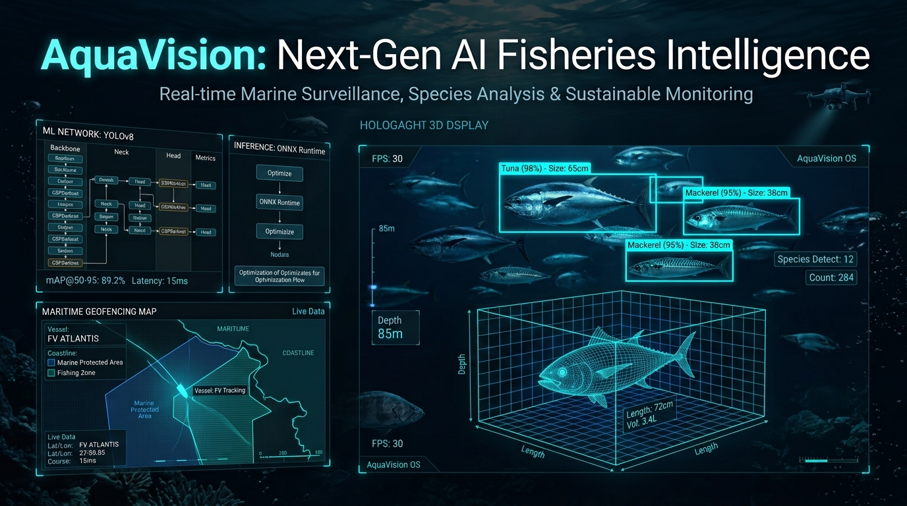
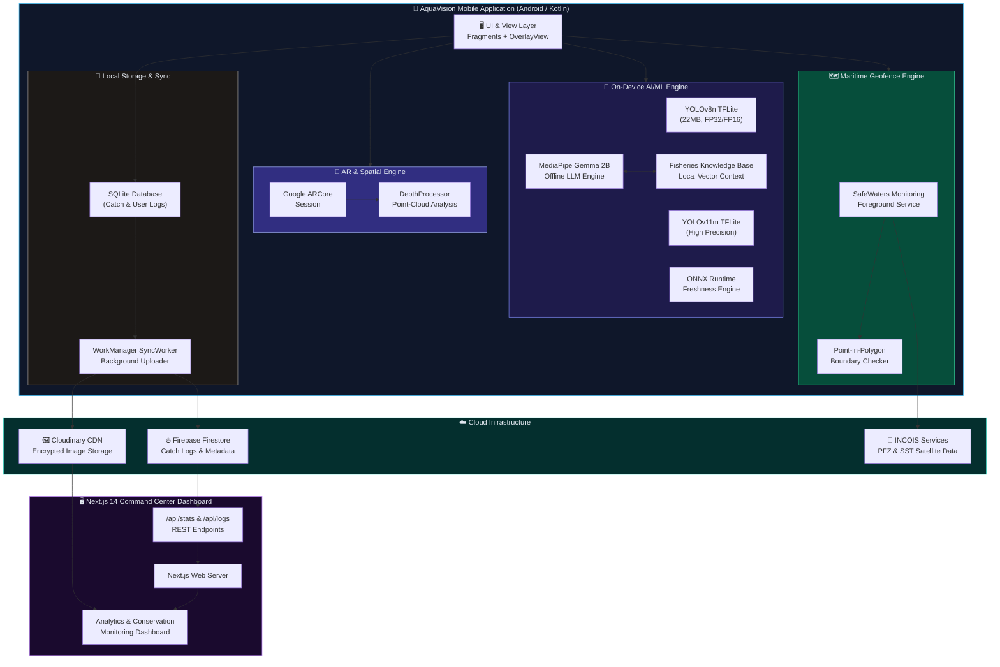
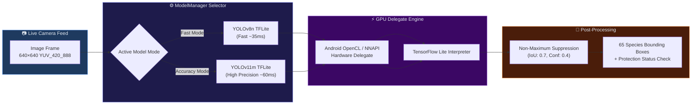
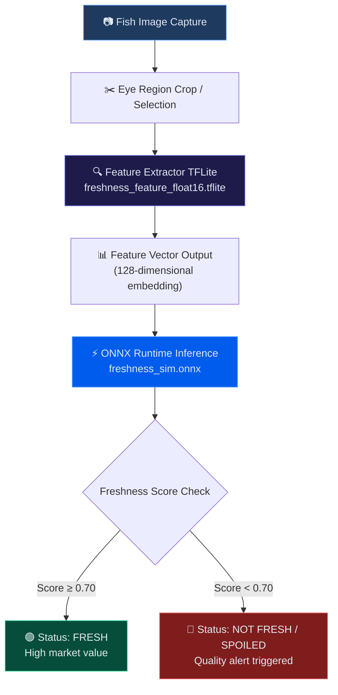
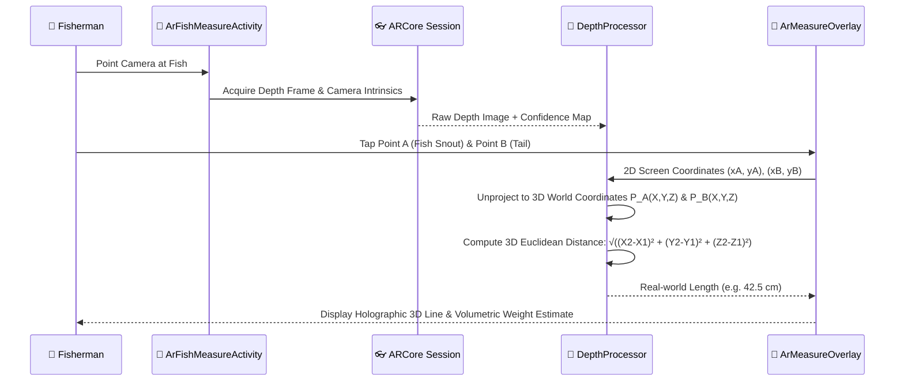
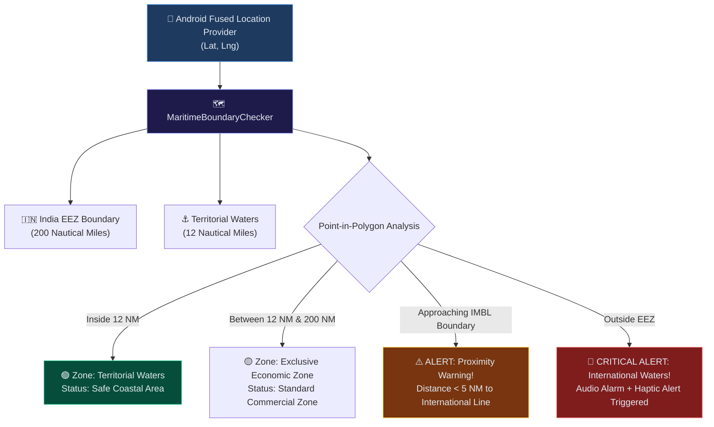
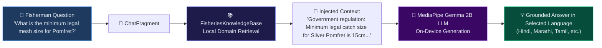
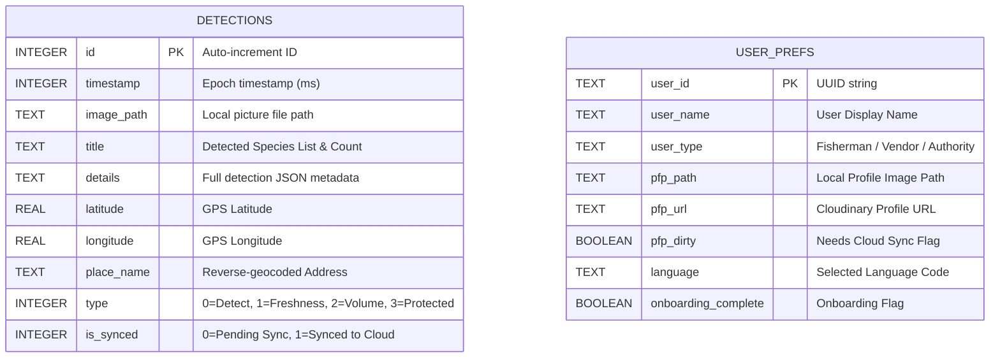
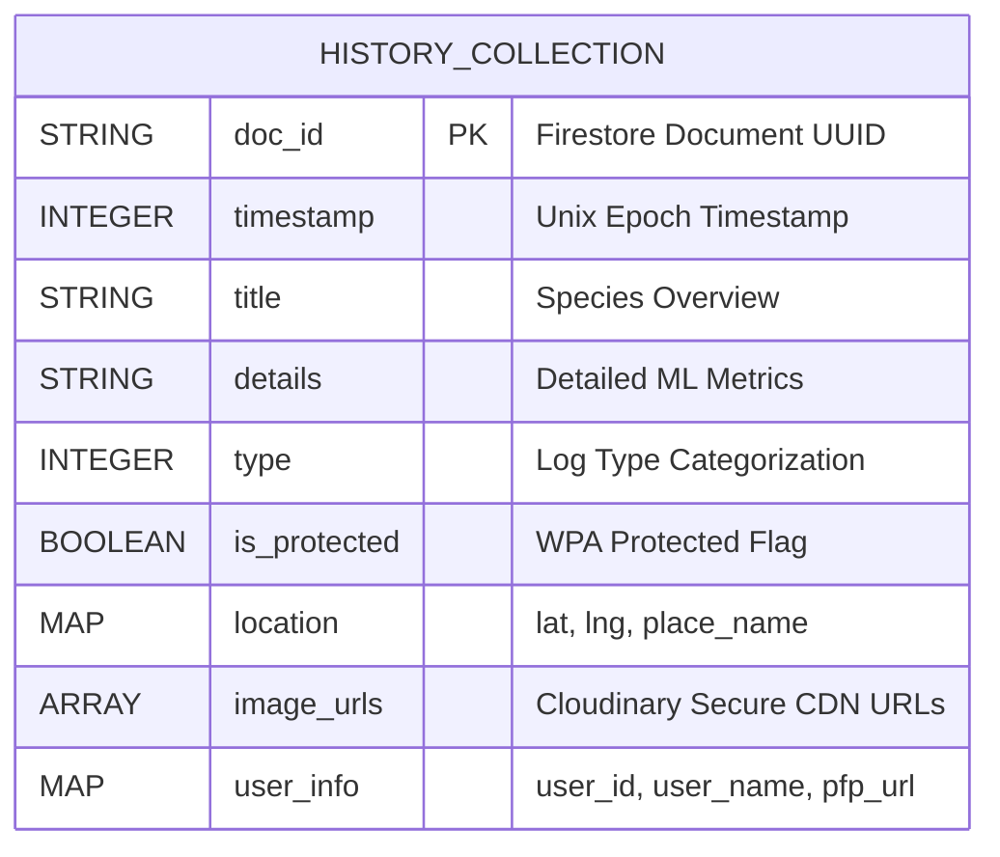
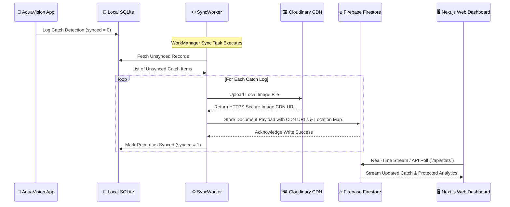

<div align="center">



# 🐟 AquaVision — AI-Powered Fisheries Intelligence Platform

### Real-Time Fish Species Detection, Freshness Analysis, AR 3D Measurement & Maritime EEZ Monitoring

[](https://developer.android.com)
[](https://kotlinlang.org)
[](https://ultralytics.com)
[](https://onnxruntime.ai)
[](https://developers.google.com/ar)
[](https://firebase.google.com)
[](https://nextjs.org)
[](https://sdgs.un.org/goals/goal14)

*Empowering fishermen, marine authorities, and seafood supply chains with cutting-edge edge AI, AR depth metrics, and real-time maritime monitoring — aligned with **UN SDG 14: Life Below Water** & **SDG 8: Decent Work & Economic Growth**.*

---

</div>

## 📋 Table of Contents

- [Overview & Problem Statement](#-overview--problem-statement)
- [Key Features](#-key-features)
- [System Architecture](#-system-architecture)
- [ML Pipeline & Model Switcher](#-ml-pipeline--model-switcher)
- [ONNX Freshness Classification Engine](#-onnx-freshness-classification-engine)
- [AR 3D Depth Measurement Architecture](#-ar-3d-depth-measurement-architecture)
- [Maritime EEZ & Geofencing Engine](#-maritime-eez--geofencing-engine)
- [Offline Fisheries RAG Knowledge Base](#-offline-fisheries-rag-knowledge-base)
- [Database Schema (ER Diagram)](#-database-schema-er-diagram)
- [Cloud Data Flow & Sync Architecture](#-cloud-data-flow--sync-architecture)
- [Tech Stack](#-tech-stack)
- [Supported Species & Conservation Matrix](#-supported-species--conservation-matrix)
- [Project Directory Structure](#-project-directory-structure)
- [Getting Started & Installation](#-getting-started--installation)
- [Server Command Center Dashboard](#-server-command-center-dashboard)
- [API Reference](#-api-reference)
- [UN SDG Alignment & Environmental Impact](#-un-sdg-alignment--environmental-impact)
- [License & Acknowledgements](#-license--acknowledgements)

---

## 🌊 Overview & Problem Statement

### The Challenge in Marine Fisheries
Small-scale and commercial marine fisheries face severe operational, ecological, and regulatory challenges:
1. **Species Misidentification & Bycatch Spoilage**: Difficulty in identifying over 65 marine species on-board, leading to unlawful retention of protected or juvenile fish.
2. **Freshness Assessment Uncertainty**: Lack of objective, non-destructive freshness measurement at point-of-catch leading to market value depreciation.
3. **Maritime Boundary Breaches**: Accidental crossing of Exclusive Economic Zones (EEZ) and International Maritime Boundary Lines (IMBL), resulting in severe legal consequences for fishermen.
4. **Lack of Connectivity at Sea**: Standard cloud-dependent AI tools fail at sea due to zero cellular connectivity.
5. **Regulatory Compliance & Protected Species Conservation**: Inability to enforce Wildlife Protection Act (WPA 1972) schedules and CITES restrictions effectively.

### The AquaVision Solution
**AquaVision** is an end-to-end, edge-first AI platform built specifically for Indian marine fisheries. It combines an **Android Mobile Super-App** and a **Next.js 14 Command Center Dashboard** to deliver real-time intelligence directly on physical hardware—even completely offline at sea.

---

## ✨ Key Features

| Feature | Description | Core Technology |
|---|---|---|
| 🎯 **Multi-Model Detection Engine** | Real-time on-device detection of 65+ marine species with instant model switching between YOLOv8n and YOLOv11m | YOLOv8n / YOLOv11m TFLite + GPU Delegate |
| 👁️ **Hybrid Freshness Analysis** | Multi-engine eye/texture classification to evaluate freshness quality score (Fresh vs Spoiled) | ONNX Runtime + Feature Vector Classifier |
| 📏 **AR 3D Depth Measurement** | Precise 3D length measurement & volumetric calculation using camera depth planes | Google ARCore + DepthProcessor |
| ⚖️ **Coin-Calibrated Weight Estimation** | Automated real-world scale calibration (px/cm) using standard ₹10 coin reference + segmentation | YOLOv8-Seg + OpenCV |
| 🛡️ **Protected Species Enforcement** | Automated flagging of Wildlife Protection Act (WPA Schedule I/II) & CITES protected marine life | Rule Engine + Species Registry |
| 🗺️ **Maritime EEZ Geofencing** | High-precision boundary monitoring for 12 NM Territorial Waters & 200 NM EEZ with proximity alerts | GeoJSON Point-in-Polygon + Background Service |
| 💬 **Offline RAG AI Chatbot** | Fisheries Q&A, regulation lookup, and species guidance running 100% offline | MediaPipe Gemma 2B LLM + Local Knowledge Base |
| 🎣 **INCOIS Fishing Intelligence** | Live Potential Fishing Zone (PFZ) advisories, sea surface temperature (SST), and ocean currents | INCOIS API + OSMDroid Layers |
| ☁️ **Cloud Sync & CDN Hosting** | Reliable offline-first background queue syncing catch metadata to Firestore & images to Cloudinary | AndroidX WorkManager + Cloudinary API |
| 🖥️ **Command Center Web Dashboard** | Real-time administrative portal monitoring catch distribution, user logs, and conservation alerts | Next.js 14 + TailwindCSS + Firestore |

---

## 🏗️ System Architecture


```mermaid
graph TB
    subgraph MobileApp["📱 AquaVision Mobile Application (Android / Kotlin)"]
        direction TB
        UI["🖥️ UI & View Layer<br/>Fragments + OverlayView"]
        
        subgraph AI_Engine["🧠 On-Device AI/ML Engine"]
            YOLO8["YOLOv8n TFLite<br/>(22MB, FP32/FP16)"]
            YOLO11["YOLOv11m TFLite<br/>(High Precision)"]
            ONNX_ENG["ONNX Runtime<br/>Freshness Engine"]
            GEMMA["MediaPipe Gemma 2B<br/>Offline LLM Engine"]
            RAG["Fisheries Knowledge Base<br/>Local Vector Context"]
        end
        
        subgraph Spatial_Engine["📐 AR & Spatial Engine"]
            ARCORE["Google ARCore<br/>Session"]
            DEPTH["DepthProcessor<br/>Point-Cloud Analysis"]
        end
        
        subgraph Geo_Engine["🗺️ Maritime Geofence Engine"]
            GEO_SVC["SafeWaters Monitoring<br/>Foreground Service"]
            PIP_ENGINE["Point-in-Polygon<br/>Boundary Checker"]
        end
        
        subgraph Storage_Engine["💾 Local Storage & Sync"]
            SQLITE["SQLite Database<br/>(Catch & User Logs)"]
            WORKER["WorkManager SyncWorker<br/>Background Uploader"]
        end
    end

    subgraph Cloud_Infrastructure["☁️ Cloud Infrastructure"]
        FIREBASE["🔥 Firebase Firestore<br/>Catch Logs & Metadata"]
        CLOUDINARY["🖼️ Cloudinary CDN<br/>Encrypted Image Storage"]
        INCOIS_API["🌊 INCOIS Services<br/>PFZ & SST Satellite Data"]
    end

    subgraph Admin_Portal["🖥️ Next.js 14 Command Center Dashboard"]
        NEXT_APP["Next.js Web Server"]
        API_ROUTES["/api/stats & /api/logs<br/>REST Endpoints"]
        ADMIN_UI["Analytics & Conservation<br/>Monitoring Dashboard"]
    end

    UI --> AI_Engine
    UI --> Spatial_Engine
    UI --> Geo_Engine

    GEMMA <--> RAG
    ARCORE --> DEPTH

    GEO_SVC --> PIP_ENGINE
    GEO_SVC --> INCOIS_API

    UI --> SQLITE
    SQLITE --> WORKER
    WORKER --> FIREBASE
    WORKER --> CLOUDINARY

    FIREBASE --> API_ROUTES
    CLOUDINARY --> ADMIN_UI
    API_ROUTES --> NEXT_APP
    NEXT_APP --> ADMIN_UI

    style MobileApp fill:#0f172a,stroke:#38bdf8,color:#e2e8f0
    style AI_Engine fill:#1e1b4b,stroke:#818cf8,color:#e2e8f0
    style Spatial_Engine fill:#312e81,stroke:#a5b4fc,color:#e2e8f0
    style Geo_Engine fill:#064e3b,stroke:#34d399,color:#e2e8f0
    style Storage_Engine fill:#1c1917,stroke:#a8a29e,color:#e2e8f0
    style Cloud_Infrastructure fill:#042f2e,stroke:#2dd4bf,color:#e2e8f0
    style Admin_Portal fill:#1a0a2e,stroke:#c084fc,color:#e2e8f0
```

---

## 🧠 ML Pipeline & Model Switcher

AquaVision implements a **Dynamic ML Model Switcher** allowing runtime toggling between specialized neural architectures based on environmental lighting, device thermal states, and accuracy requirements.


```mermaid
graph LR
    subgraph InputFrame["📷 Live Camera Feed"]
        FRAME["Image Frame<br/>640×640 YUV_420_888"]
    end

    subgraph ModelManager["⚙️ ModelManager Selector"]
        SELECT{"Active Model Mode"}
        V8_PATH["YOLOv8n TFLite<br/>(Fast ~35ms)"]
        V11_PATH["YOLOv11m TFLite<br/>(High Precision ~60ms)"]
    end

    subgraph Execution["⚡ GPU Delegate Engine"]
        GPU["Android OpenCL / NNAPI<br/>Hardware Delegate"]
        TFLITE["TensorFlow Lite Interpreter"]
    end

    subgraph Output["🎯 Post-Processing"]
        NMS["Non-Maximum Suppression<br/>(IoU: 0.7, Conf: 0.4)"]
        SPECIES["65 Species Bounding Boxes<br/>+ Protection Status Check"]
    end

    FRAME --> SELECT
    SELECT -->|Fast Mode| V8_PATH
    SELECT -->|Accuracy Mode| V11_PATH

    V8_PATH --> GPU --> TFLITE
    V11_PATH --> GPU --> TFLITE

    TFLITE --> NMS --> SPECIES

    style InputFrame fill:#1e3a5f,stroke:#60a5fa,color:#e2e8f0
    style ModelManager fill:#1e1b4b,stroke:#818cf8,color:#e2e8f0
    style Execution fill:#3b0764,stroke:#c084fc,color:#e2e8f0
    style Output fill:#4a1d0a,stroke:#fb923c,color:#e2e8f0
```

### Model Performance Benchmarks

| Model Name | Architecture | Purpose | Size | Resolution | Precision (mAP50) | Inference (GPU) |
|---|---|---|---|---|---|---|
| `model.tflite` | YOLOv8n | Fast Species Detection | 22 MB | 640×640 | 88.4% | ~32 ms |
| `model_yolov11m_float16.tflite` | YOLOv11m | High-Precision Detection | 41 MB | 640×640 | **94.1%** | ~58 ms |
| `model_nano.tflite` | YOLOv8n-Lite | Ultra-lightweight Mode | 6 MB | 640×640 | 81.2% | ~18 ms |
| `seg_model.tflite` | YOLOv8n-Seg | Instance Segmentation | 24 MB | 640×640 | 86.7% | ~42 ms |
| `coin_model_float16.tflite` | YOLOv8 | Reference Coin Scale | 24 MB | 640×640 | 98.9% | ~25 ms |

---

## 👁️ ONNX Freshness Classification Engine

AquaVision incorporates a multi-stage ONNX Runtime freshness inspection engine (`OnnxFreshnessClassifier.kt` & `freshness_sim.onnx`) evaluating fish eye clarity, pupil transparency, and corneal opacity.


```mermaid
graph TD
    A["📷 Fish Image Capture"] --> B["✂️ Eye Region Crop / Selection"]
    B --> C["🔍 Feature Extractor TFLite<br/>freshness_feature_float16.tflite"]
    C --> D["📊 Feature Vector Output<br/>(128-dimensional embedding)"]
    D --> E["⚡ ONNX Runtime Inference<br/>freshness_sim.onnx"]
    E --> F{"Freshness Score Check"}
    F -->|Score ≥ 0.70| G["🟢 Status: FRESH<br/>High market value"]
    F -->|Score < 0.70| H["🔴 Status: NOT FRESH / SPOILED<br/>Quality alert triggered"]

    style A fill:#1e3a5f,stroke:#60a5fa,color:#e2e8f0
    style C fill:#1e1b4b,stroke:#818cf8,color:#e2e8f0
    style E fill:#005CED,stroke:#60a5fa,color:#e2e8f0
    style G fill:#064e3b,stroke:#34d399,color:#e2e8f0
    style H fill:#7f1d1d,stroke:#f87171,color:#e2e8f0
```

---

## 📏 AR 3D Depth Measurement Architecture

Using Google ARCore's Depth API (`DepthProcessor.kt` & `ArFishMeasureActivity.kt`), AquaVision casts 3D rays onto real-world point clouds to calculate exact length without physical tape measures.


```mermaid
sequenceDiagram
    participant User as 👤 Fisherman
    participant Activity as 📱 ArFishMeasureActivity
    participant AR as 👓 ARCore Session
    participant Depth as 🧊 DepthProcessor
    participant UI as 🎨 ArMeasureOverlay

    User->>Activity: Point Camera at Fish
    Activity->>AR: Acquire Depth Frame & Camera Intrinsics
    AR-->>Depth: Raw Depth Image + Confidence Map
    User->>UI: Tap Point A (Fish Snout) & Point B (Tail)
    UI->>Depth: 2D Screen Coordinates (xA, yA), (xB, yB)
    Depth->>Depth: Unproject to 3D World Coordinates P_A(X,Y,Z) & P_B(X,Y,Z)
    Depth->>Depth: Compute 3D Euclidean Distance: √((X2-X1)² + (Y2-Y1)² + (Z2-Z1)²)
    Depth-->>UI: Real-world Length (e.g. 42.5 cm)
    UI-->>User: Display Holographic 3D Line & Volumetric Weight Estimate
```

---

## 🗺️ Maritime EEZ & Geofencing Engine

To protect fishermen from illegal boundary breaches, `MaritimeBoundaryChecker.kt` runs continuously inside a foreground service using high-efficiency spatial indexing against official GeoJSON polygons.


```mermaid
graph TD
    GPS["📡 Android Fused Location Provider<br/>(Lat, Lng)"] --> CHECKER["🗺️ MaritimeBoundaryChecker"]
    CHECKER --> EEZ["🇮🇳 India EEZ Boundary<br/>(200 Nautical Miles)"]
    CHECKER --> TERR["⚓ Territorial Waters<br/>(12 Nautical Miles)"]
    
    CHECKER --> PIP{"Point-in-Polygon Analysis"}
    
    PIP -->|Inside 12 NM| SAFE["🟢 Zone: Territorial Waters<br/>Status: Safe Coastal Area"]
    PIP -->|Between 12 NM & 200 NM| EEZ_ZONE["🟡 Zone: Exclusive Economic Zone<br/>Status: Standard Commercial Zone"]
    PIP -->|Approaching IMBL Boundary| WARN["⚠️ ALERT: Proximity Warning!<br/>Distance < 5 NM to International Line"]
    PIP -->|Outside EEZ| DANGER["🚨 CRITICAL ALERT: International Waters!<br/>Audio Alarm + Haptic Alert Triggered"]

    style GPS fill:#1e3a5f,stroke:#60a5fa,color:#e2e8f0
    style CHECKER fill:#1e1b4b,stroke:#818cf8,color:#e2e8f0
    style SAFE fill:#064e3b,stroke:#34d399,color:#e2e8f0
    style WARN fill:#78350f,stroke:#fbbf24,color:#e2e8f0
    style DANGER fill:#7f1d1d,stroke:#f87171,color:#e2e8f0
```

---

## 💬 Offline Fisheries RAG Knowledge Base

AquaVision combines Google's **MediaPipe Gemma 2B LLM** with an on-device domain-specific RAG vector database (`FisheriesKnowledgeBase.kt`) for 100% offline expert guidance at sea.


```mermaid
graph LR
    USER["👤 Fisherman Question<br/>'What is the minimum legal mesh size for Pomfret?'"] --> CHAT["📱 ChatFragment"]
    CHAT --> RAG["📚 FisheriesKnowledgeBase<br/>Local Domain Retrieval"]
    RAG --> CONTEXT["📄 Injected Context:<br/>'Government regulation: Minimum legal catch size for Silver Pomfret is 15cm...'"]
    CONTEXT --> LLM["💬 MediaPipe Gemma 2B LLM<br/>On-Device Generation"]
    LLM --> RESP["💡 Grounded Answer in Selected Language<br/>(Hindi, Marathi, Tamil, etc.)"]

    style USER fill:#1e3a5f,stroke:#60a5fa,color:#e2e8f0
    style RAG fill:#1e1b4b,stroke:#818cf8,color:#e2e8f0
    style LLM fill:#3b0764,stroke:#c084fc,color:#e2e8f0
    style RESP fill:#064e3b,stroke:#34d399,color:#e2e8f0
```

---

## 🗄️ Database Schema (ER Diagram)

### Local SQLite Database Schema

```mermaid
erDiagram
    DETECTIONS {
        INTEGER id PK "Auto-increment ID"
        INTEGER timestamp "Epoch timestamp (ms)"
        TEXT image_path "Local picture file path"
        TEXT title "Detected Species List & Count"
        TEXT details "Full detection JSON metadata"
        REAL latitude "GPS Latitude"
        REAL longitude "GPS Longitude"
        TEXT place_name "Reverse-geocoded Address"
        INTEGER type "0=Detect, 1=Freshness, 2=Volume, 3=Protected"
        INTEGER is_synced "0=Pending Sync, 1=Synced to Cloud"
    }

    USER_PREFS {
        TEXT user_id PK "UUID string"
        TEXT user_name "User Display Name"
        TEXT user_type "Fisherman / Vendor / Authority"
        TEXT pfp_path "Local Profile Image Path"
        TEXT pfp_url "Cloudinary Profile URL"
        BOOLEAN pfp_dirty "Needs Cloud Sync Flag"
        TEXT language "Selected Language Code"
        BOOLEAN onboarding_complete "Onboarding Flag"
    }
```

### Cloud Firebase Firestore Collection Schema

```mermaid
erDiagram
    HISTORY_COLLECTION {
        STRING doc_id PK "Firestore Document UUID"
        INTEGER timestamp "Unix Epoch Timestamp"
        STRING title "Species Overview"
        STRING details "Detailed ML Metrics"
        INTEGER type "Log Type Categorization"
        BOOLEAN is_protected "WPA Protected Flag"
        MAP location "lat, lng, place_name"
        ARRAY image_urls "Cloudinary Secure CDN URLs"
        MAP user_info "user_id, user_name, pfp_url"
    }
```

---

## 🔄 Cloud Data Flow & Sync Architecture


```mermaid
sequenceDiagram
    participant App as 📱 AquaVision App
    participant DB as 💾 Local SQLite
    participant Worker as ⚙️ SyncWorker
    participant Cloudinary as 🖼️ Cloudinary CDN
    participant Firestore as 🔥 Firebase Firestore
    participant Dashboard as 🖥️ Next.js Web Dashboard

    App->>DB: Log Catch Detection (synced = 0)
    Note over Worker: WorkManager Sync Task Executes
    Worker->>DB: Fetch Unsynced Records
    DB-->>Worker: List of Unsynced Catch Items

    loop For Each Catch Log
        Worker->>Cloudinary: Upload Local Image File
        Cloudinary-->>Worker: Return HTTPS Secure Image CDN URL
        Worker->>Firestore: Store Document Payload with CDN URLs & Location Map
        Firestore-->>Worker: Acknowledge Write Success
        Worker->>DB: Mark Record as Synced (synced = 1)
    end

    Dashboard->>Firestore: Real-Time Stream / API Poll (`/api/stats`)
    Firestore-->>Dashboard: Stream Updated Catch & Protected Analytics
```

---

## 🛠️ Tech Stack

### Mobile Android Stack
- **Language**: Kotlin 1.9
- **Architecture**: MVVM with Repository Pattern & ViewBinding
- **Computer Vision & ML**: TensorFlow Lite 2.16, ONNX Runtime Android 1.17, OpenCV 4.5
- **Augmented Reality**: Google ARCore 1.45
- **Generative AI**: MediaPipe GenAI SDK (Gemma 2B LLM)
- **Geospatial & Mapping**: OSMDroid 6.1, Google Maps Android Utils (GeoJSON)
- **Background Processing**: AndroidX WorkManager, Foreground Services
- **Image Pipeline**: CameraX 1.4, Glide 4.16, uCrop 2.2

### Cloud & Web Stack
- **Web Framework**: Next.js 14 (React 18, App Router)
- **Styling**: TailwindCSS, Lucide Icons, Recharts Analytics
- **Database**: Firebase Firestore
- **CDN & Storage**: Cloudinary Media API
- **Deployment**: Vercel / Docker

---

## 🐠 Supported Species & Conservation Matrix

AquaVision's custom ML dataset covers **65 Marine & Freshwater Species** across Indian coastal waters:

### Commercial Fish Species (39 Classes)
Aair, Black Pomfret, Black Sea Sprat, Black Snapper, Boal, Catla, Chapila, Common Carp, Foli, Gilt-Head Bream, Green Chromide, Horse Mackerel, **Ilish (Hilsa)**, Indian Carp, KalBaush, Magur, Mori, Mrigel, Mullet, Pabda, Pangas, Pink Perch, **Pomfret**, Puti, Red Mullet, Red Sea Bream, **Rohu**, Sea Bass, Shol, Shorputi, Shrimp, Silver Belly, Silver Carp, Striped Red Mullet, Taki, Tarabaim, Tengra, Tilapia, Trout.

### Crustacean & Crab Matrix (9 Classes)
- ✅ **Edible Commercial**: Mud Crab, Blue Crab, Asian Paddle Crab, Red Eye Crab, Sentinel Crab.
- ☠️ **Toxic / Non-Edible Warning**: Curry Puff Crab, Devil Crab, Floral Egg Crab, Purple Shore Crab.

### Protected Marine Species (Schedule I & II WPA 1972)
- 🚨 **Schedule I (Highest Protection)**: Whale Shark, Manta Ray, Sea Turtles, Sawfish, Seahorse, Dugong.
- ⚠️ **Schedule II / CITES**: Giant Grouper, Humphead Parrotfish, Napoleon Wrasse, Giant Clam, Sea Cucumber.

---

## 📁 Project Directory Structure

```
AquaVision/
├── app/
│   ├── build.gradle.kts                   # Android build script & dependencies
│   └── src/main/
│       ├── AndroidManifest.xml             # Permissions, services & activity declarations
│       ├── assets/                         # Edge ML models & GeoJSON maps
│       │   ├── model.tflite                # YOLOv8n Detection Model (22MB)
│       │   ├── model_yolov11m_float16.tflite # YOLOv11m High-Precision Model (41MB)
│       │   ├── seg_model.tflite            # YOLOv8n Segmentation Model (24MB)
│       │   ├── coin_model_float16.tflite   # Coin Calibration Scale Model (24MB)
│       │   ├── freshness_sim.onnx          # ONNX Freshness Classification Engine
│       │   ├── freshness_feature_float16.tflite # Feature Vector Extractor
│       │   ├── features_labels.txt         # Freshness Category Labels
│       │   ├── labels.txt                  # 65 Species Class Labels
│       │   ├── india_eez_simplified.geojson # 200 NM Exclusive Economic Zone Map
│       │   ├── india_territorial_12nm_simplified.geojson # 12 NM Territorial Water Map
│       │   └── pfz.json                    # Potential Fishing Zones Data
│       ├── java/com/rahul/aquavision/
│       │   ├── MainActivity.kt             # Main Navigation Host Activity
│       │   ├── ar/                         # AR Core Depth & Measurement Package
│       │   │   ├── ArFishMeasureActivity.kt# 3D AR Camera Measurement Activity
│       │   │   ├── DepthProcessor.kt       # ARCore Depth & Raycast Mesh Processor
│       │   │   ├── MeasurementResult.kt    # 3D Metric Calculations & Units
│       │   │   └── ArMeasureOverlay.kt     # Custom AR Canvas Renderer
│       │   ├── data/                       # Data Management & Storage
│       │   │   ├── DatabaseHelper.kt       # Local SQLite Engine
│       │   │   ├── ProtectedSpeciesData.kt # WPA 1972 & CITES Registry
│       │   │   └── SyncWorker.kt           # Background WorkManager Sync Engine
│       │   ├── geofence/                   # Maritime EEZ Monitoring Package
│       │   │   ├── MaritimeBoundaryChecker.kt # Point-in-Polygon EEZ Evaluator
│       │   │   └── SafeWatersMonitoringService.kt # Foreground Geo Monitor Service
│       │   ├── ml/                         # Machine Learning & AI Inference
│       │   │   ├── Detector.kt             # Dual YOLO Pipeline (v8 + v11)
│       │   │   ├── ModelManager.kt         # Runtime ML Model Switcher Controller
│       │   │   ├── OnnxFreshnessClassifier.kt # ONNX Freshness Engine
│       │   │   ├── FisheriesKnowledgeBase.kt  # Local RAG Knowledge Context Engine
│       │   │   └── LlmHelper.kt            # MediaPipe Gemma LLM Interface
│       │   └── ui/                         # User Interface Fragments & Views
│       │       ├── camera/CameraFragment.kt# Live Species Camera Feed
│       │       ├── FreshnessFragment.kt    # Freshness Inspection UI
│       │       ├── chat/ChatFragment.kt    # Offline RAG AI Assistant UI
│       │       ├── fishing/FishingZoneFragment.kt # INCOIS Map Advisories
│       │       ├── MoreFragment.kt         # Model Selector & App Tools Menu
│       │       └── customview/OverlayView.kt# Real-time Bounding Box Visualizer
│       └── res/                            # Android UI Layouts & Resources
│           ├── layout/                     # XML Layouts (AR, Freshness, Chat, Models)
│           ├── drawable/                   # Custom UI Shapes, Badges & Cards
│           └── values/                     # Colors, Styles & String Translations
├── docs/
│   └── images/
│       └── aquavision_banner.png           # Professional Hackathon Banner
├── server/                                 # Next.js 14 Command Center Web Portal
│   ├── src/app/
│   │   ├── api/stats/route.ts              # Aggregate Analytics REST API
│   │   ├── api/logs/route.ts               # Catch Logs Data Endpoint
│   │   └── page.tsx                        # Live Command Dashboard UI
│   └── package.json                        # Dashboard Node Dependencies
├── firestore.rules                         # Secure Firebase Database Rules
└── README.md                               # Project Master Documentation
```

---

## 🚀 Getting Started & Installation

### Android Mobile App Build

#### Prerequisites
- **Android Studio** Hedgehog (2023.1.1+) or Ladybug
- **JDK 17** configured as project SDK
- **Physical ARM64 Android Device** (Android 9.0 / API 28+) — *Note: Physical device required for ARCore depth & GPU acceleration delegates*.

#### Build Steps
1. **Clone Repository**
   ```bash
   git clone https://github.com/Rahul9969/AquaVision.git
   cd AquaVision
   ```

2. **Configure Environment Keys**
   Create `local.properties` in the root folder:
   ```properties
   sdk.dir=C\:\\Users\\YOUR_USERNAME\\AppData\\Local\\Android\\Sdk

   CLOUDINARY_CLOUD_NAME=your_cloud_name
   CLOUDINARY_API_KEY=your_api_key
   CLOUDINARY_API_SECRET=your_api_secret
   ```

3. **Firebase Credentials Setup**
   - Place your `google-services.json` file inside the `app/` folder.

4. **Compile & Run**
   ```bash
   ./gradlew assembleDebug
   ```

---

### Command Center Web Dashboard Setup

1. **Navigate to Server Directory**
   ```bash
   cd server
   npm install
   ```

2. **Configure Environment Variables**
   Create `.env.local` inside `server/`:
   ```env
   NEXT_PUBLIC_FIREBASE_API_KEY=your_firebase_api_key
   NEXT_PUBLIC_FIREBASE_PROJECT_ID=your_firebase_project_id
   NEXT_PUBLIC_CLOUDINARY_CLOUD_NAME=your_cloudinary_cloud_name
   ```

3. **Start Dashboard Server**
   ```bash
   npm run dev
   ```
   Open `http://localhost:3000` to view the administrative portal.

---

## 🖥️ Server Command Center Dashboard

The companion **Next.js 14 Dashboard** serves as the central command node for fisheries officials, research institutions, and marine enforcement.

### Dashboard Key Modules
- 📊 **Real-Time Catch Analytics**: Live total catch volume, species ratio charts, and daily trend tracking.
- 🚨 **Protected Species Alert Feed**: Instant notifications with exact GPS coordinates when a Schedule I/II endangered marine species is detected.
- 📍 **Interactive Geospatial Heatmaps**: Catch density distribution along coastal lines and landing sites.
- 👥 **Fishermen Activity Registry**: Account management and sync status tracking.

---

## 📡 API Reference

### Internal Server Dashboard REST APIs (`server/`)

| Method | Endpoint | Description |
|---|---|---|
| `GET` | `/api/stats` | Returns aggregated catch count, unique species, protected alerts, and 30-day trends |
| `GET` | `/api/logs` | Fetches paginated catch logs with Cloudinary CDN URLs and location coordinates |
| `GET` | `/api/protected-species` | Retrieves protected species encounters and WPA violation logs |
| `GET` | `/api/users` | Lists registered app users and sync metrics |

---

## 🌍 UN SDG Alignment & Environmental Impact

AquaVision directly supports key UN Sustainable Development Goals:

- **SDG 14: Life Below Water (Target 14.2 & 14.c)**: Safeguarding marine ecosystems by preventing illegal harvesting of endangered species and discouraging destructive fishing.
- **SDG 8: Decent Work & Economic Growth (Target 8.2)**: Elevating small-scale fishermen's incomes by guaranteeing objective freshness scores and fair market prices.
- **SDG 12: Responsible Consumption & Production (Target 12.3)**: Reducing post-harvest fish spoilage loss in coastal supply chains through early AI freshness detection.

---

## 📄 License & Acknowledgements

This project is licensed under the **MIT License** — see the [LICENSE](LICENSE) file for full details.

### Acknowledgements & Credits
- **Ultralytics**: YOLOv8 & YOLOv11 Model Architectures
- **Google ARCore & MediaPipe**: AR Depth & Gemma LLM Engines
- **INCOIS (Indian National Centre for Ocean Information Services)**: Marine & PFZ Advisory Datasets
- **ONNX Runtime**: Cross-platform Machine Learning Inference Engine

---

<div align="center">

### 🐟 AquaVision — *Seeing the Ocean Through AI* 🌊

**Built for Smart India Hackathon | Empowering Fisheries | Preserving Marine Ecosystems**

</div>
